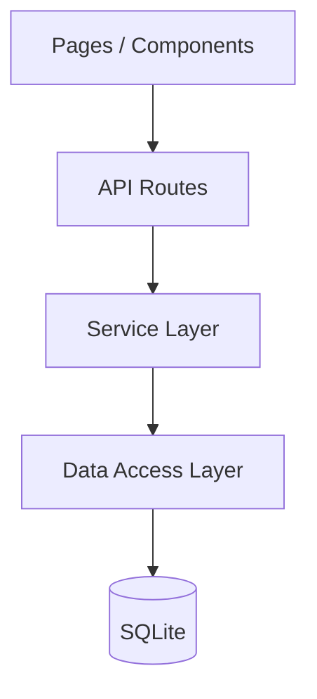

# 员工日程管理系统

基于 Next.js + SQLite 构建的企业内部日程管理平台，支持员工创建/管理个人日程、管理员统筹全员安排。

## 功能特性

| 模块 | 功能 |
|------|------|
| 🔐 认证系统 | JWT 登录/注册，角色区分（员工/管理员） |
| 📅 我的日程 | 周视图 / 月视图切换，日程增删改查 |
| 👥 管理员面板 | 查看全员日程，按人员/范围筛选 |
| 🎨 可视化状态 | 待开始/进行中/已完成/已取消 四色标记 |
| ⚡ 数据持久化 | SQLite 本地存储，支持 WAL 模式 |

## 技术栈

- **框架**: Next.js 14 (App Router)
- **语言**: TypeScript
- **样式**: Tailwind CSS
- **数据库**: SQLite (better-sqlite3)
- **认证**: JWT + bcryptjs
- **运行时**: Node.js ≥ 18

## 项目结构

```
schedule-system/
├── src/
│   ├── app/                        # Next.js App Router 页面层
│   │   ├── page.tsx                # 登录/注册页
│   │   ├── layout.tsx              # 全局布局
│   │   ├── globals.css             # 全局样式
│   │   ├── dashboard/              # 员工仪表盘
│   │   │   ├── layout.tsx          # 带顶栏的布局
│   │   │   └── page.tsx            # 日程主视图
│   │   ├── admin/                  # 管理员面板
│   │   │   └── page.tsx            # 全员日程总览
│   │   └── api/                    # API 路由层
│   │       ├── auth/
│   │       │   ├── login/route.ts  # POST 登录
│   │       │   ├── register/route.ts # POST 注册
│   │       │   └── me/route.ts     # GET 当前用户
│   │       └── schedules/
│   │           ├── route.ts        # GET 列表 / POST 创建
│   │           └── [id]/route.ts   # GET/PUT/DELETE 单项
│   ├── components/                 # 可复用组件
│   │   ├── Calendar/
│   │   │   ├── WeekCalendar.tsx    # 周视图日历
│   │   │   └── MonthCalendar.tsx   # 月视图日历
│   │   └── Schedule/
│   │       └── ScheduleModal.tsx   # 日程创建/编辑弹窗
│   ├── lib/                        # 基础设施层
│   │   ├── db.ts                   # 数据库连接池
│   │   ├── auth.ts                 # JWT 认证工具
│   │   └── schedule-service.ts     # 日程业务逻辑
│   └── types/
│       └── index.ts                # 全局类型定义
├── db/
│   ├── schema.sql                  # 建表 DDL
│   └── seed.sql                    # 种子数据
├── scripts/
│   ├── init-db.mjs                 # 数据库初始化
│   └── seed.mjs                    # 种子数据写入
├── .env.example
├── .gitignore
├── next.config.js
├── tailwind.config.ts
├── tsconfig.json
└── package.json
```

## 快速开始

### 1. 安装依赖

```bash
npm install
```

### 2. 初始化数据库

```bash
npm run setup
```

### 3. 启动开发服务器

```bash
npm run dev
```

访问 http://localhost:3000

### 4. 使用测试账号登录

| 角色 | 用户名 | 密码 |
|------|--------|------|
| 管理员 | `admin` | `123456` |
| 员工 | `zhangsan` | `123456` |
| 员工 | `lisi` | `123456` |
| 员工 | `wangwu` | `123456` |

## API 接口

### 认证

| 方法 | 路径 | 说明 |
|------|------|------|
| POST | `/api/auth/login` | 登录 |
| POST | `/api/auth/register` | 注册 |
| GET | `/api/auth/me` | 获取当前用户 |

### 日程

| 方法 | 路径 | 说明 |
|------|------|------|
| GET | `/api/schedules?range=week\|month` | 获取日程列表 |
| POST | `/api/schedules` | 创建日程 |
| GET | `/api/schedules/:id` | 获取日程详情 |
| PUT | `/api/schedules/:id` | 更新日程 |
| DELETE | `/api/schedules/:id` | 删除日程 |

## 架构设计要点

### 分层架构



- **Pages**：用户交互层，纯 UI 渲染
- **API Routes**：HTTP 协议层，处理请求/响应、认证
- **Service Layer**：业务逻辑层，数据校验、权限判断
- **Data Access Layer**：数据库操作封装

### 权限模型

| 操作 | 员工 | 管理员 |
|------|:---:|:-----:|
| 创建日程 | ✅ | ✅ |
| 查看自己的日程 | ✅ | ✅ |
| 修改自己的日程 | ✅ | ✅ |
| 删除自己的日程 | ✅ | ✅ |
| 查看他人日程 | ❌ | ✅ |
| 修改他人日程 | ❌ | ✅ |

### 安全措施

- 密码 bcrypt 哈希存储
- JWT Token 7天过期
- API 层统一认证/授权校验
- Cookie httpOnly 防 XSS
- SQL 参数化防注入

## License

MIT
